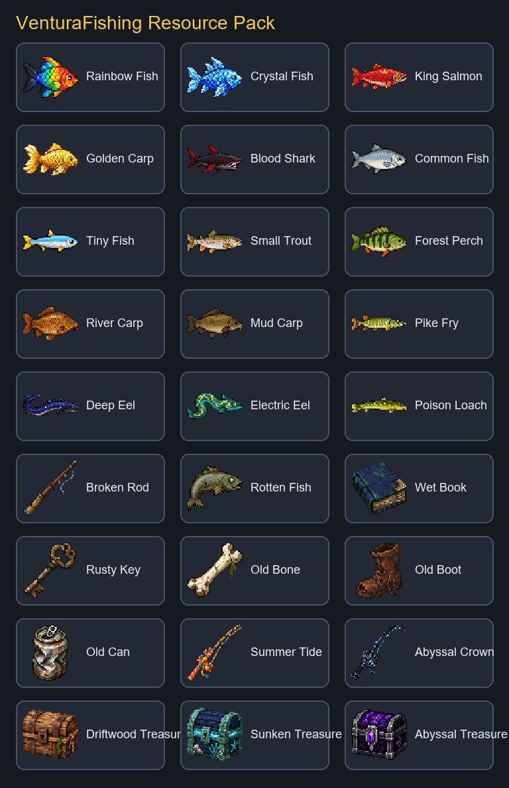

# VenturaFishing Resource Pack

Готовый resource pack для VenturaFishing: уникальные рыбы, мусор, две особые удочки
и три Treasure Chest без ItemsAdder или Oraxen.



## Скачать и подключить

1. Скачайте [последний ZIP](https://github.com/diegokaos/ventura-resourcepack/releases/latest/download/VenturaFishing-ResourcePack-1.21.x.zip).
2. Вставьте настройки из `server.properties.example` в `server.properties`.
3. Полностью перезапустите сервер.

```properties
resource-pack=https://github.com/diegokaos/ventura-resourcepack/releases/latest/download/VenturaFishing-ResourcePack-1.21.x.zip
resource-pack-sha1=27689fe77fe7ecec856aeff183bd998eda10f63d
require-resource-pack=true
```

## Совместимость

Он поддерживает все релизные версии Minecraft Java от `1.21` до `1.21.11`:

| Версии клиента | Механизм моделей |
| --- | --- |
| `1.21`, `1.21.1`, `1.21.2`, `1.21.3` | legacy `models/item` + `overrides` |
| `1.21.4`, `1.21.5`, `1.21.6`, `1.21.7`, `1.21.8`, `1.21.9`, `1.21.10`, `1.21.11` | item models из overlay `modern_1_21_4` |

Minecraft сам выбирает нужный слой по версии клиента. Делить pack на несколько ZIP или менять
настройку сервера при обновлении в пределах этого диапазона не нужно.

## Содержимое

- `VenturaFishing-ResourcePack-1.21.x.zip` — готовый pack из последнего Release.
- `SHA1.txt` и `server.properties.example` — актуальные данные для подключения к серверу.
- `texture-preview.png` и `pack.png` — превью и иконка pack.
- `templates/` — многослойный PSD, PNG-сетка 64×64 и русская инструкция по рисованию.

Актуальная контрольная сумма готового ZIP находится в `SHA1.txt`.

## Готовые модели

Pack содержит шесть моделей улова, две модели удочек и три модели сокровищ:

| ID | Тип | model-data | Базовый материал |
| --- | --- | ---: | --- |
| `rainbow_fish` | улов | 1101 | `PUFFERFISH` |
| `crystal_fish` | улов | 1102 | `COD` |
| `salmon_king` | улов | 1103 | `SALMON` |
| `golden_carp` | улов | 1104 | `TROPICAL_FISH` |
| `shark` | улов | 1105 | `PUFFERFISH` |
| `old_boot` | мусор | 1199 | `RABBIT_HIDE` |
| `summer_tide` | сезонная удочка | 2101 | `FISHING_ROD` |
| `abyssal` | лимитированная удочка | 2102 | `FISHING_ROD` |
| `driftwood_chest` | обычное сокровище | 3101 | `CHEST` |
| `sunken_chest` | редкое сокровище | 3102 | `CHEST` |
| `abyssal_chest` | сокровище Бездны | 3103 | `CHEST` |

Модели удочек применяются только к предметам, которые выдал VenturaFishing с соответствующим
`CustomModelData`. Ванильная удочка из творческого режима специально остаётся ванильной. Для работы
нужны одновременно этот pack и актуальный JAR плагина; после замены JAR полностью перезапустите сервер.

Модели сундуков назначаются предметам Treasure системой плагина. Их шансы, регионы и
таблицы наград редактируются в `plugins/VenturaFishing/treasures.yml`.

## Сборка

В полном исходном проекте VenturaFishing запустите из его корня:

```powershell
powershell -NoProfile -ExecutionPolicy Bypass -File .\resource-pack\build-resource-pack.ps1
```

`Bypass` действует только для этого запуска и не меняет системную политику PowerShell.

После любого изменения текстур или моделей запустите скрипт снова и загрузите новый ZIP на хостинг.
В `server.properties` также должен попасть новый SHA-1 из `SHA1.txt`.

## Добавление своей модели

Чтобы новая модель работала на всём диапазоне 1.21.x, её нужно прописать в обоих форматах:

1. Создайте текстуру и модель в `pack/assets/venturafishing/`.
2. Добавьте integer-предикат в `pack/assets/minecraft/models/item/<material>.json` для 1.21–1.21.3.
3. Добавьте тот же номер в `pack/modern_1_21_4/assets/minecraft/items/<material>.json` для 1.21.4+.
4. Укажите этот положительный номер в `model-data` нужного улова в `fish.yml`, удочки в `rods.yml`
   или сундука в `treasures.yml`.
5. Пересоберите pack скриптом выше.

Не повторяйте одну пару `material + model-data`: именно она определяет нужную модель. Для точного
совпадения в современном `range_dispatch` после значения модели оставляйте возврат к ванильной модели
на пороге `model-data + 0.5`, как сделано в готовых JSON.

Для `FISHING_ROD` дополнительно сохраните состояние заброшенной удочки: legacy-модель должна иметь
предикат `cast`, а современная — условие `minecraft:fishing_rod/cast`. Готовый `fishing_rod.json`
можно использовать как шаблон.
